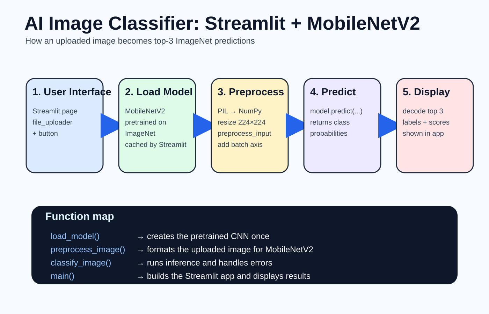
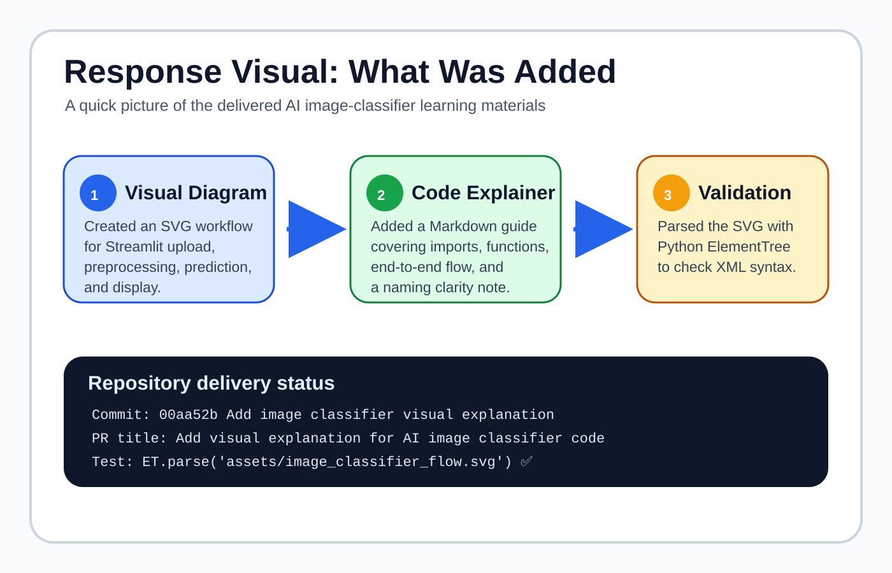

# AI Image Classifier code explanation



This Streamlit app lets a user upload a `.jpg` or `.png` image, sends that image through a pretrained MobileNetV2 neural network, and shows the top three ImageNet predictions with confidence percentages.

## What the imports do

- `cv2` is OpenCV. The code uses it to resize the uploaded image to the input size MobileNetV2 expects.
- `numpy` converts the image into an array and adds a batch dimension.
- `streamlit` builds the web interface: title, uploader, button, spinner, errors, and prediction output.
- `MobileNetV2`, `preprocess_input`, and `decode_predictions` come from Keras. They provide the pretrained model, model-specific input formatting, and human-readable labels.
- `PIL.Image` opens the uploaded file as an image object.

## Function-by-function walkthrough

### `load_model()`

`load_model()` creates a MobileNetV2 model with `weights="imagenet"`. That means the model has already learned to classify the 1,000 ImageNet categories, so this app can run inference without training a new neural network.

### `preprocess_image(image)`

`preprocess_image()` prepares one uploaded image for MobileNetV2:

1. Converts the PIL image to a NumPy array.
2. Resizes it to `224 x 224` pixels, which is the default MobileNetV2 input size.
3. Applies `preprocess_input()` so pixel values are scaled the way MobileNetV2 expects.
4. Adds a first dimension with `np.expand_dims(..., axis=0)`, turning one image into a batch of one image.

### `classify_image(model, image)`

`classify_image()` runs the prediction pipeline:

1. Preprocesses the uploaded image.
2. Calls `model.predict(processed_image)` to get prediction scores.
3. Calls `decode_predictions(predictions, top=3)[0]` to convert raw model output into the three most likely labels.
4. If anything goes wrong, it shows a Streamlit error message and returns `None`.

### `main()`

`main()` defines the Streamlit application:

1. Configures the page title, icon, and layout.
2. Displays the app title and short instructions.
3. Defines `load_cached_model()` with `@st.cache_resource` so the model is loaded once and reused across interactions.
4. Shows a file uploader that accepts `.jpg` and `.png` files.
5. Displays the uploaded image.
6. Waits for the user to click **Classify Image**.
7. Opens the uploaded file with PIL, classifies it, and prints each predicted label with a percentage score.

## End-to-end flow

```text
User uploads image
        ↓
Streamlit displays image and waits for button click
        ↓
PIL opens the uploaded file
        ↓
OpenCV resizes image to 224 x 224
        ↓
Keras preprocesses pixel values
        ↓
MobileNetV2 predicts ImageNet classes
        ↓
decode_predictions converts scores to labels
        ↓
Streamlit displays top-3 predictions
```

## Important note

The line `image = st.image(...)` displays the uploaded file and stores Streamlit's display return value in `image`. Later, inside the button block, `image = Image.open(uploaded_file)` reuses the same variable name for the actual PIL image. The app can still work, but using separate names such as `displayed_image` and `pil_image` would make the code clearer.

## Visual summary of the repository update

The response summary is also available as a separate visual that shows the delivered diagram, explanatory document, validation check, commit, and pull request metadata.


